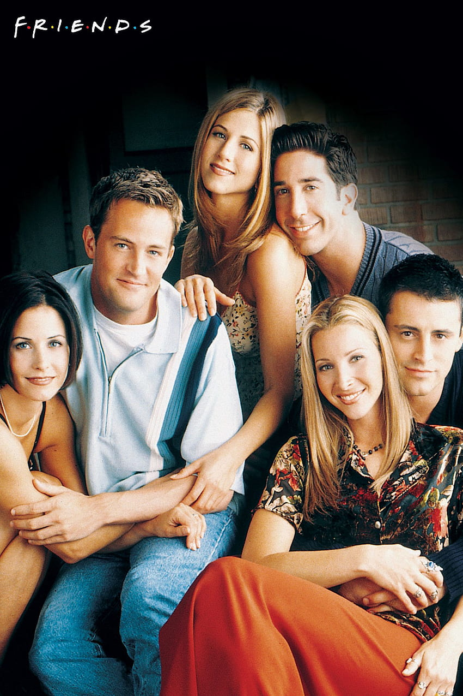

# FaceSwipe-AI-Project

This project is all about the art of face swapping between two images! 🎭

## Original Image

## Swapped Images
### Swapped Image 1

### Swapped Image 2

## Project Overview

This Python project uses the power of AI and computer vision to seamlessly swap faces between multiple individuals in an image. It's both fun and fascinating!

## Project Components

### Face Detection and Analysis

We utilize [InsightFace](https://github.com/deepinsight/insightface), a fantastic open-source face analysis toolkit, to detect and analyze faces in the images. This toolkit provides us with the ability to identify facial landmarks and essential facial features.

### Swapping Magic

The real magic happens when we employ the [inswapper_128.onnx](https://github.com/deepinsight/insightface/blob/master/recognition/insightface/app/inswapper_128.onnx) model, which is capable of swapping faces while maintaining a realistic appearance. This model is at the heart of our face-swapping operation.

## How to Use

1. Prepare your images. You'll need two images: the source image containing the face you want to swap onto others and an image with multiple faces for swapping.

2. Run the Python script provided in this repository. Make sure you have all the required libraries installed, including OpenCV, InsightFace, and Matplotlib.

3. Watch as the magic unfolds! The script will detect faces in both images, analyze them, and seamlessly swap faces, generating new images with swapped faces.

## Disclaimer

While this project is a fascinating exploration of AI and computer vision, please use it responsibly and respect privacy and ethical considerations when working with images of individuals.

Happy Face Swapping! 🌟

Important! - download **inswapper_128.onnx** this file from https://www.reddit.com/r/midjourney/comments/13pnraj/please_reupload_inswapper_128onnx/